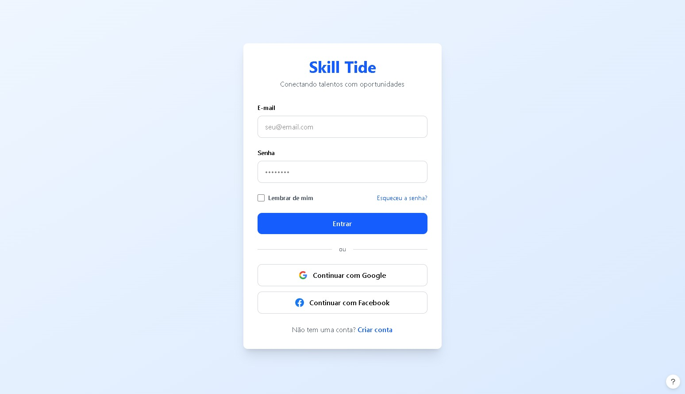
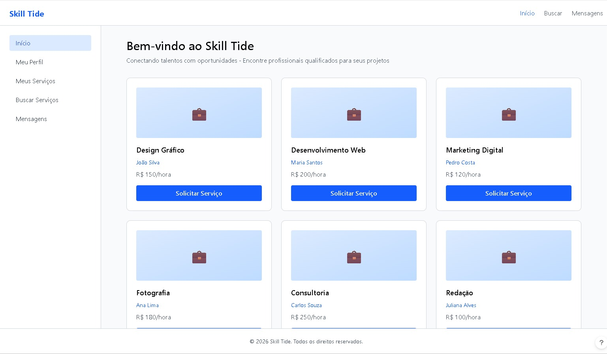
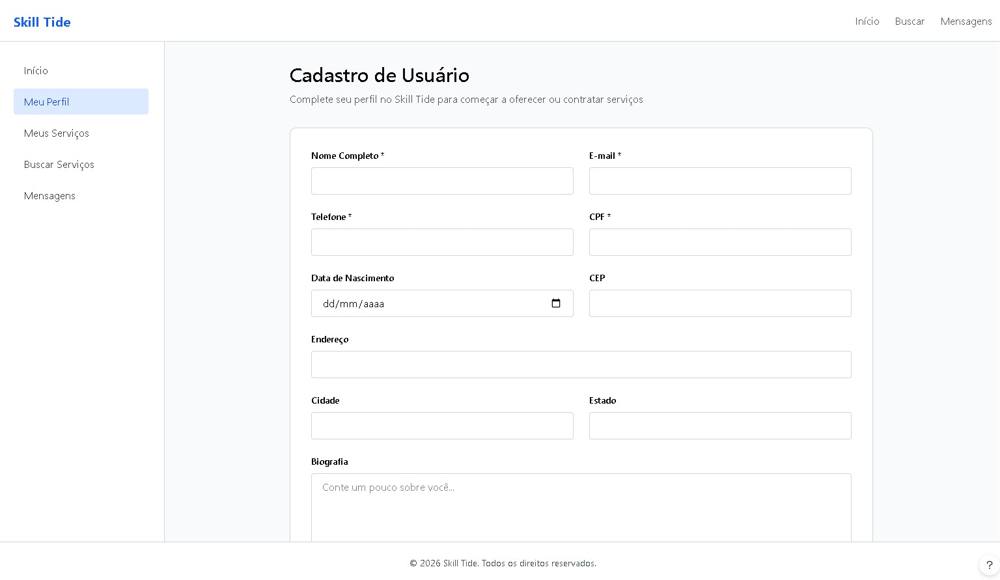
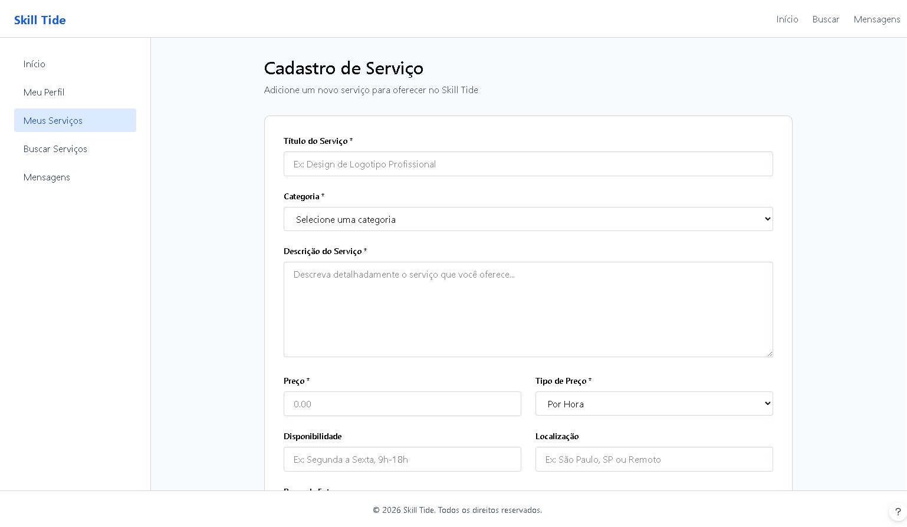
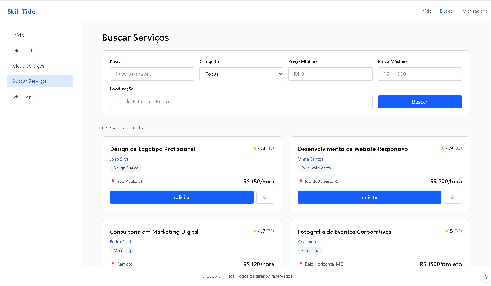
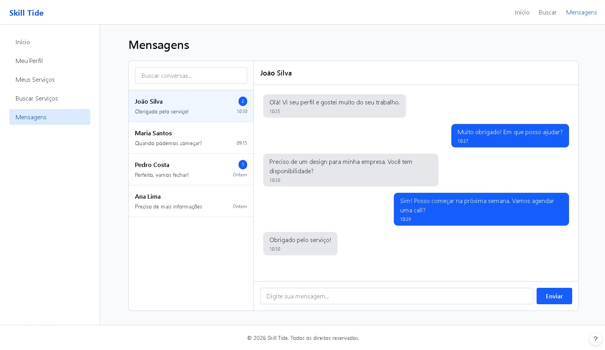
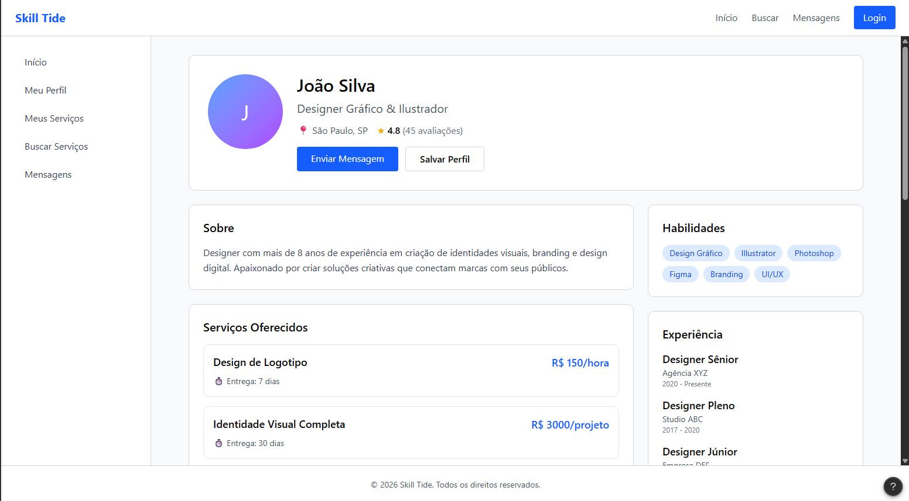

# Projeto de Interface
O Projeto de Interface tem como finalidade manter a estrutura do sistema de naveção pelos usuários e manter a interação entre aplicação e indivíduo, garantino uma naveção segura, clara, limpa, rápida e de fácil acesso, tudo isso alinhado aos objetivos do sistema. O projeto abrange o fluxo de navegação pelo usuário (User FLow) e a elaboração e aplicação dos wireframes da página. 

A construção das interfaces foi guiada pelos requisitos funcionais, não funcionais e histórias de usuário abordados nas Documentação de Especificação. Os wireframes apresentados a seguir demonstram como as funcionalidades foram distribuídas nas telas, priorizando a usabilidade, a coerência visual e a eficiência na execução das tarefas pelos usuários.

## User Flow

## Wireframes

São protótipos usados em design de interface para sugerir a estrutura de um site web e seu relacionamentos entre suas páginas. Um wireframe web é uma ilustração semelhante do layout de elementos fundamentais na interface e é fundamental sempre relacionar cada wireframe com o(s) requisito(s) que ele atende.

### Tela de login

||
|:--------------------------------------------------------------------------------------------:|
| **Figura 2: Tela de login**   

| **Componente**               | **Requisitos Atendidos**                                                                 |
|------------------------------|------------------------------------------------------------------------------------------|
| **Tela de login**              | RF01:	Permitir cadastro de usuários no sistema.|

### Home page - Tela inicial

||
|:--------------------------------------------------------------------------------------------:|
| **Figura 3: Tela Inicial**   

| **Componente**               | **Requisitos Atendidos**                                                                 |
|------------------------------|------------------------------------------------------------------------------------------|
| **Tela Inicial**              | RF10 Permitir tela inicial intuitiva que mostre sugestões de serviços do interesse do usuário.|

## Cadastro de Usuário

||
|:--------------------------------------------------------------------------------------------:|
| **Figura 4: Cadastro de Usuários**   

| **Componente**               | **Requisitos Atendidos**                                                                 |
|------------------------------|------------------------------------------------------------------------------------------|
| **Cadastro de Usuários**              | RF02: Permitir cadastro de prestadores de serviços.|

## Cadastro de Serviços

||
|:--------------------------------------------------------------------------------------------:|
| **Figura 5: Cadastro de Serviços**   

| **Componente**               | **Requisitos Atendidos**                                                                 |
|------------------------------|------------------------------------------------------------------------------------------|
| **Cadastro de Serviços**              | RF03: Permitir cadastro e descrição de serviços oferecidos.   RF06: Permitir classificação entre serviço voluntário e remunerado.|

## Busca de Serviços

||
|:--------------------------------------------------------------------------------------------:|
| **Figura 6: Busca de Serviços**   

| **Componente**               | **Requisitos Atendidos**                                                                 |
|------------------------------|------------------------------------------------------------------------------------------|
| **Busca de Serviços**              | RF04: Permitir filtragem por categoria, valor do serviço e localidade.     RF05: Permitir visualização detalhada dos serviços.   RF08: Permitir solicitação de serviços.|

## Chat para usuários

||
|:--------------------------------------------------------------------------------------------:|
| **Figura 7: Chat para usuários**   

| **Componente**               | **Requisitos Atendidos**                                                                 |
|------------------------------|------------------------------------------------------------------------------------------|
| **Página de contato**              | RF07: Permitir comunicação entre usuários do sistema.|

## Visualização de perfil

||
|:--------------------------------------------------------------------------------------------:|
| **Figura 8: Visualização de perfil**   

| **Componente**               | **Requisitos Atendidos**                                                                 |
|------------------------------|------------------------------------------------------------------------------------------|
| **Visualização de perfil**              | RF09: Permitir a visualização de perfis dos outros usuários da plataforma, incluindo suas habilidades, histórico de serviços prestados, e avaliações.|

### Exemplo

A tela inicial apresenta um menu lateral com as principais seções do portal, enquanto a navigation bar, ao topo, apresenta informações de envio de imagens ou navegação pela galeria de fotos. A área central apresenta a galeria de fotos na forma de uma grade. Nesta tela, são apresentados os seguintes requisitos

 
> **Links Úteis**:
> - [Protótipos vs Wireframes](https://www.nngroup.com/videos/prototypes-vs-wireframes-ux-projects/)
> - [Ferramentas de Wireframes](https://rockcontent.com/blog/wireframes/)
> - [MarvelApp](https://marvelapp.com/developers/documentation/tutorials/)
> - [Figma](https://www.figma.com/)
> - [Adobe XD](https://www.adobe.com/br/products/xd.html#scroll)
> - [Axure](https://www.axure.com/edu) (Licença Educacional)
> - [InvisionApp](https://www.invisionapp.com/) (Licença Educacional)
