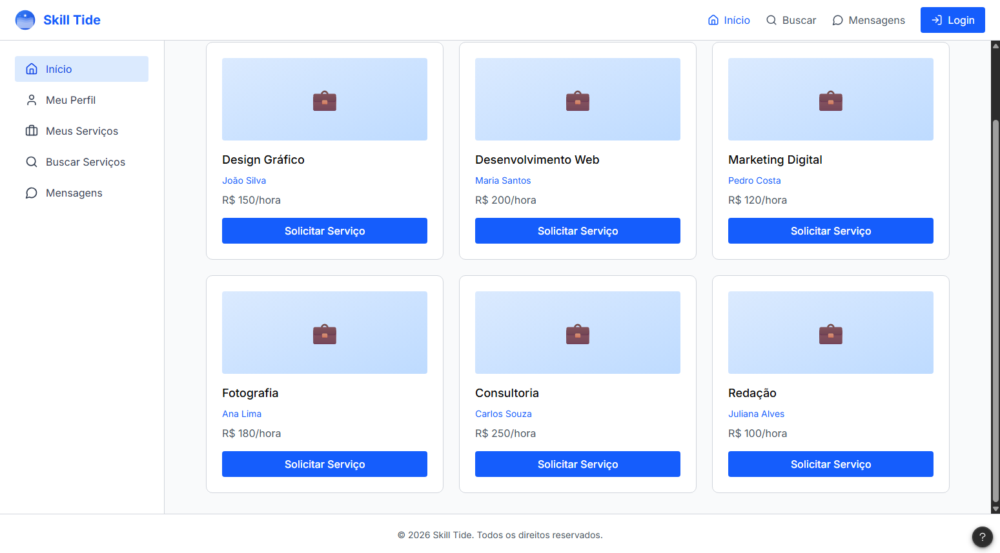

# Template padrão do site

O projeto utiliza um layout base em HTML e CSS padronizado para todas as páginas da aplicação. Esse template define a identidade visual, contempla princípios de responsividade para diferentes dispositivos e incorpora iconografia funcional com base em bibliotecas modernas.

## Design

<
Interface baseada em Menu Lateral + Rodapé, com conteúdo central organizado em campo de busca e cards de habilidades.

Logo da Aplicação

Localização: Canto superior esquerdo, dentro do menu lateral
Nome exibido: Skill Tide
Função: Redireciona o usuário direto para a tela inicial da aplicação
Acessibilidade: alt="Logo Tradeskills - Início"

## Menus Padrões Interativos

### Menu Lateral

Meu Perfil - Direciona o usuário para a página do seu cadastro/ página do seu perfil na aplicação
Meu Serviços - Exibe suas qualificações e o serviço que pretende prestar para outros usuários
Buscar Serviços - Local onde usuários irão encontrar os serviços selecionados, cadastrados por outros usuários
Mensagens - Local por onde os usuários irão se comunicar de maneira ágil e eficiente.

### Campo de Buscas 

Buscar Palavras-Chave - Campo onde o usuário irá digitar os serviços que almeja
Categoria - Pemite que o usuário selecione a área específica do serviço (ex: Educação)
Preço mínimo/Preço máximo - Permite que o usuário adicione valores monetários para busca
Localização - Executa a busca por onde o usuário deseja prestar ou contratar o serviço
Botão buscar - Executa a pesquisa digitada no campo de busca.

## Cores

| Cor             | HEX       | 
| :-------------- | :-------- | 
| brown           | `#734858` |
| blue-700        | `#165FF2` |
| blue-700        | `#296CF2` |
| bluish-gray     | `#C2DCF2` |
| gray-600        | `#F2F2F2``|

O layout utiliza uma combinação de texto, ícones e formas para transmitir significado, assegurando que a interface seja operável e compreensível mesmo sem a percepção de cores.

## Tipografia

A tipografia da aplicação será feita em fonte Inter, totalmente moderna, mais clean e amplamente usada em projetos web. Isto permitirá uma visualização clara da aplicação pelos usuários. 

## Iconografia

A iconografia do sistema define os ícones utilizados para facilitar a navegação e representar ações de forma clara.

### Guia de Estilo CSS
Nesta seção estão descritos os estilos gerais aplicados a todos os ícones da aplicação.
O objetivo é padronizar tamanho, cor e comportamento visual, garantindo consistência em toda a interface. 
 
 #### **Classe Base para Ícones**
 
 A classe base.icon define o estilo padrão que pode ser aplicado a todos os ícones. Apesar de ser a configuração base, ela pode ser modificada conforme a necessidade do contexto. Essas modificações, como variação de cor e tamamanho serão mostradas a seguir.

  
     .icon {
    
        display: inline-block;
     
        width:20px;
     
        height:20px;

        fill: currentColor; /* herda a cor do texto do elemento pai */

        vertical-align: middle;
     
      }

   
   ##### **Ícone Pequeno**:
    

      .icon-sm {
    
          width:12px;
     
          height:12px;
     
       }

   ##### **Ícone Médio**:
    

      .icon-md {
    
          width:24px;
     
          height:24px;
     
       }

 ##### **Ícone Grande**:
    

      .icon-lg {
    
          width: 40px;
     
          height: 40px;
     
       }

 #### **Cores Opcionais**
   
   ##### **Cor Primária**:
    

      .icon-primary {
    
          fill: #161917;
     
       }

   ##### **Cor Secundária**:
    

      .icon-secondary {
    
          fill: #535353;
     
       }

 ##### **Cor de Sucesso**:
    

      .icon-success {
    
          fill: #21A134;
     
       }

   ##### **Cor de Perigo/Erro**:
    

      .icon-danger {
    
          fill: #D02828;
     
       }

   ##### **Cor para Ícones Desativados**:
    

      .icon-muted {
    
          fill: #E5E7EB;
     
       }
